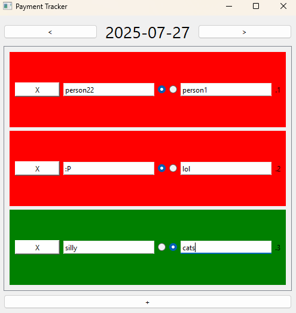

# Daily Customer & Employee Payment Tracker

A simple desktop tool built with PySide6 and SQLite to manage daily records of customers and employees.  
Originally designed for a small business to track who paid and which employee was responsible.

## 📌 Features
- Add / remove customers for each day
- Mark as paid (shows red/green highlight)
- Assign an employee name
- Browse days back and forward
- Data saved locally in SQLite database
- Quick save shortcut (Ctrl+S)

## ⚙️ Requirements
- Python 3.8+
- PySide6

Install:
```bash
pip install PySide6
```
## 📝 Notes
Made as a first real GUI project

Specialized for daily tracking (not a general accounting app)

Data stored locally in mydata.db SQLite file

Not actively maintained

## 📷 Screenshot


## 🫀Support🐱
Uhh..., If you somehow find this small project helpful, You can [buy me a coffee](https://buymeacoffee.com/relizu)

## 📖 License
MIT License — free to use and modify, no warranty.
